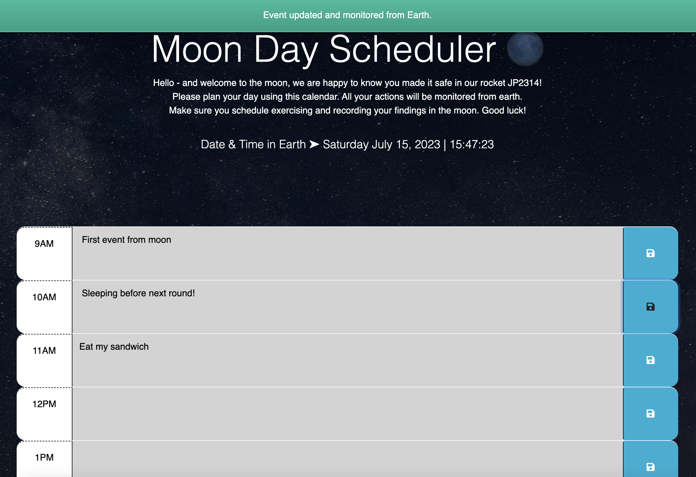

# Moon-Day-Scheduler

### ~ Third-Party APIs Challenge: Work Day Scheduler 🌝

## Description

Hello - and welcome to the moon, we are happy to know you made it safe in our rocket JP2314!
Please plan your day using this calendar. All your actions will be monitored from earth.
Make sure you schedule exercising and recording your findings in the moon. Good luck!

---

I really enjoyed doing this challenge. I was able to learn how dayjs works and how to use also the timers here to display the notifications when an event is saved or updated. From the javascript file we are basically able to modify any DOM element and with the use of JQUERY we are also able to access elements, moodify them and manipulate them as needed.

## Table of Contents (Optional)

- [Installation](#installation)
- [Usage](#usage)
- [Credits](#credits)
- [License](#license)

## Installation

To run the project in your local machine:

1. Open visual studio in your computer or laptop
2. Clone the git project: https://github.com/lilianpatinoortiz/Moon-Day-Scheduler
3. Pull the latest from the 'main' branch
4. Locate the index.html file
5. Right click on the file and select "Open in default browser"
6. A new window on your default browser should open with the web page containing the project

Access the deployed project here: https://lilianpatinoortiz.github.io/Moon-Day-Scheduler/

## Usage

After cloning and running the project you will be able to add events to your moon calendar!
The hour will be colored different depending on the time. Red is the current hour in Earth, green is future hour in Earth and gray is a past hour in Earth. You can add and modify the events for the day. The events will persist even if you refresh the page. Use it wisely and please make sure you register any information we can use to help you for our mission! Good luck

## Credits

The main resources used:

- Bootcamp canvas - Module 04
- Notification stackoverflow question: https://stackoverflow.com/questions/48305623/how-do-i-make-a-notification-disappear

## License

Please refer to the LICENSE in the repo.
